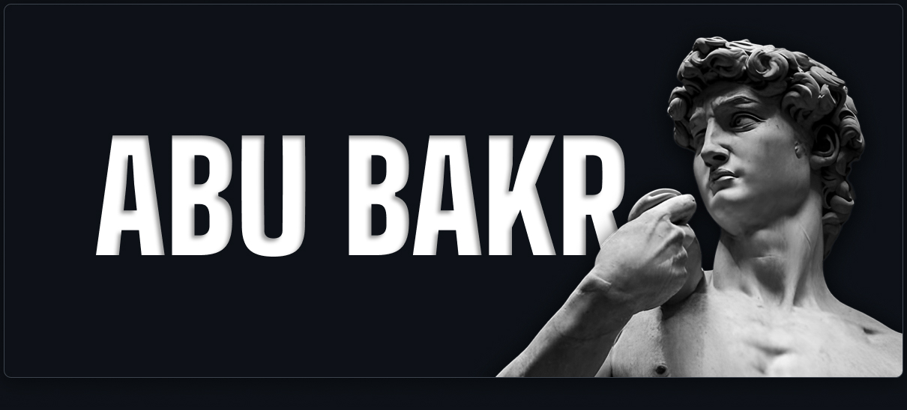

  
  
  
  
  

 

<!-- <h2 align="center">  <em>About  me: </em></h2> -->

<h1 align="center">About Me:</h1>

 

Hello There! <em><b> I'm AbuBakr Gulomov </b></em>, a "Digital Craftsman". I build, craft and code things for fun. This GitHub is just where I put the stuff I am learning, building or messing around with. Now I'm working at some little and fun projects to put in practice my knowledge about JavaScript, React, Bootstrap and more.

 

      <em><b> Target International School '26 </b></em>  
      <em><b> Building Vinex.uz </b></em> 
      <em><b> Front-End Developer & UI/UX Designer </b></em> 

 
 

<h2 align="center">  <em> Technologies </em> </h2>

  
  
  
  
  
  
  
  

 
 

<h2 align="center"">  <em> Statistics </em> </h2>

 

  

<h3 align="center"> <em> Visitor Count </em> </h3>

  

